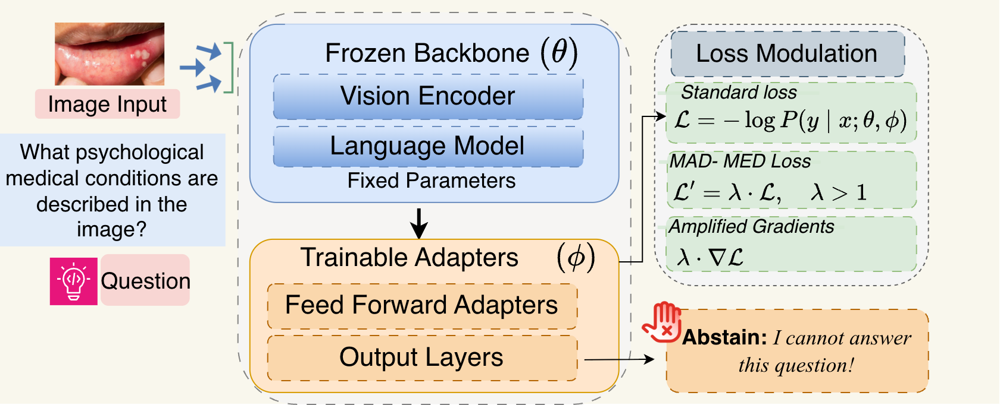

# MAD-MED: Model Abstention in Medical Vision-Language Models

> **Learn To Say NO! Incorporating Model Abstention In Medical Vision-Language Models for Pharmacovigilance**

This repository contains the **LLaVA-Med implementation** associated with our work on **MAD-MED (Model Abstention for Drug Adverse Reaction for MEDical-VLMs)**.

The project investigates how a medical vision-language model can learn to **abstain when the available evidence is insufficient**, rather than producing unsupported or potentially misleading answers. The proposed approach keeps the pretrained backbone frozen and uses lightweight trainable adapters together with an abstention-aware loss.

**Code release:** The implementation is currently being prepared. Selected training and evaluation code for **LLaVA-Med** will be released here soon.

---

## Overview

Medical vision-language models are often expected to answer questions even when the required evidence is missing from the image, the accompanying clinical text, or both. In pharmacovigilance settings, this can result in unsupported answers and hallucinations.

**MAD-MED** treats abstention as a learned generation behavior. Instead of relying on an external confidence estimator or an inference-time threshold, the model is trained to produce an explicit abstention response when a question cannot be reliably answered from the provided context.

The framework considers three principal sources of abstention:

- **Evidence insufficiency** — the required information is not present in the available modalities.
- **Knowledge boundary** — the query falls outside the model's effective knowledge.
- **Ethical and safety constraints** — answering may be inappropriate or unsafe in a clinical setting.

---

## Architecture

The following diagram provides an overview of the MAD-MED framework.

  

**Figure:** MAD-MED keeps the pretrained medical VLM backbone frozen and trains lightweight adapters to learn abstention-aware behavior.

---

## Evaluation

The experiments evaluate abstention behavior under three input configurations:

| Setting | Input |
|---|---|
| **Image-Only** | Medical image + question |
| **Text-Only** | Clinical text + question |
| **Image + Text** | Medical image + clinical text + question |

The evaluation considers both the ability to abstain when appropriate and the ability to continue answering questions when sufficient evidence is available.

Reported evaluation measures include:

- Precision
- Recall
- F1-score
- Abstention Accuracy (AA)
- Hallucination Rate (HR)
- Clinical Accuracy
- Jaccard Similarity (JS)
- BERTScore (BS)

---

## Dataset

The work introduces **ADR-ABS (Adverse Drug Reaction ABStention)**, an augmented multimodal dataset built from the MMADE adverse drug reaction benchmark.

The dataset contains questions covering:

1. **Image-answerable questions**
2. **Text-dependent questions**
3. **Unanswerable questions**

These categories provide supervision for learning when the model should answer and when it should abstain.

The paper describes the construction and annotation procedure in detail, including expert review and the selection of six final questions per multimodal sample.

---

## Paper: **Learn To Say NO! Incorporating Model Abstention In Medical Vision-Language Models for Pharmacovigilance**

**Authors**

- Sofia Jamil
- Chinmay Purushottam Bhat*
- Sooraj Veer R*
- Sriparna Saha

\* Equal contribution

**Department of Computer Science & Engineering**  
**Indian Institute of Technology Patna, India**

---

### Citation

---

**Will be updated soon!**

---

## Acknowledgements

This work was conducted at the **Department of Computer Science & Engineering, Indian Institute of Technology Patna**.

---

## Contact

For questions regarding the implementation or research, please contact the authors.

- **Chinmay Purushottam Bhat** — `chinmay_2511ai26@iitp.ac.in`
- **Sooraj Veer R** — `sooraj_2511ai18@iitp.ac.in`
- **Sofia Jamil** — `sofia_2321cs16@iitp.ac.in`

---

## Disclaimer

This repository contains research code for a medical AI study. The models and outputs are intended for **research purposes only** and should not be used as a substitute for professional medical advice, diagnosis, or treatment.
